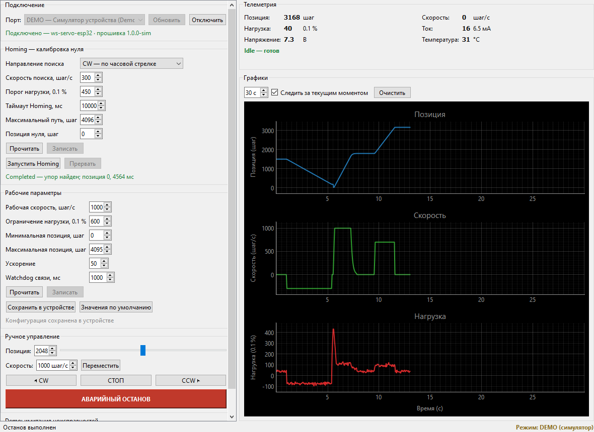
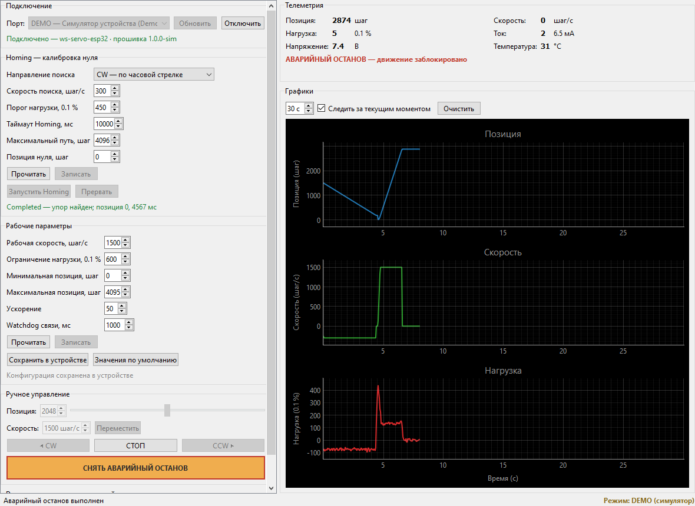

# Конфигуратор сервопривода Feetech STS3215

Настольное приложение и прошивка ESP32 для конфигурации, калибровки и
диагностики сервопривода **Feetech STS3215**, подключённого через контроллер
**Waveshare Servo Driver with ESP32** (SKU 21593) по USB Type-C / Serial.



Приложение позволяет подключиться к контроллеру, прочитать и записать
параметры работы, выполнить поиск механического нуля, управлять приводом в
позиционном и непрерывном режимах и наблюдать телеметрию на графиках в
реальном времени — не изменяя ничего в исходном коде.

**Приложение запускается и полностью работает без оборудования**: в списке
портов первым идёт встроенный симулятор устройства.

## Содержание

- [Быстрый старт](#быстрый-старт)
- [Возможности](#возможности)
- [Архитектура](#архитектура)
- [Протокол ПК ↔ ESP32](#протокол-пк--esp32)
- [Прошивка ESP32](#прошивка-esp32)
- [Подключение оборудования](#подключение-оборудования)
- [Первое включение на оборудовании](#первое-включение-на-оборудовании)
- [Если что-то не работает](#если-что-то-не-работает)
- [Homing: алгоритм и меры безопасности](#homing-алгоритм-и-меры-безопасности)
- [Режим симуляции](#режим-симуляции)
- [Тесты и проверка работоспособности](#тесты-и-проверка-работоспособности)
- [Сценарий приёмки](#сценарий-приёмки)
- [Известные ограничения](#известные-ограничения)
- [Что стоит сделать дальше](#что-стоит-сделать-дальше)
- [Лицензии](#лицензии)

## Быстрый старт

Требуется Python 3.11 или новее (разрабатывалось на 3.13).

```bash
python -m venv .venv
.venv\Scripts\activate           # Windows
# source .venv/bin/activate      # Linux / macOS
pip install -r requirements.txt
python desktop_app/main.py
```

В окне выберите порт **`DEMO — Симулятор устройства`** и нажмите
«Подключить»: приложение заработает целиком, без платы и привода.
Для реального устройства выберите его COM-порт в том же списке.

Ключи запуска: `--verbose` — подробный журнал, `--log-file ПУТЬ` — писать
журнал в файл.

Тот же сценарий можно пройти без интерфейса:

```bash
python desktop_app/demo_cli.py          # через симулятор
python desktop_app/demo_cli.py COM3     # через реальную плату
```

Проверить, что установка работоспособна, можно не открывая окно:

```bash
python desktop_app/main.py --self-test
```

Приложение подключится к симулятору, прочитает конфигурацию, получит
телеметрию, наполнит графики и завершится с ненулевым кодом при любой неудаче.

### Сборка исполняемого файла

```bash
pip install pyinstaller
pyinstaller packaging/servo_configurator.spec
dist/servo-configurator.exe --self-test
```

Результат — один файл около 51 МБ, запускается без установленного Python.
Консоль оставлена намеренно: в неё идёт журнал, который нужен при разборе
неполадок связи на стенде.

## Возможности

| Блок | Что делает |
| --- | --- |
| Подключение | список портов с обновлением, выбор, подключение и отключение, состояние связи |
| Homing | направление, скорость, порог нагрузки, таймаут, предельный путь, позиция нуля; запуск и статус процедуры |
| Рабочие параметры | скорость, ограничение нагрузки, границы диапазона, ускорение, watchdog связи; чтение, запись, сохранение в памяти устройства, значения по умолчанию |
| Ручное управление | целевая позиция, перемещение, вращение CW и CCW, СТОП, аварийный останов |
| Телеметрия | позиция, скорость, нагрузка, ток, напряжение, температура, состояние и ошибки |
| Графики | позиция, скорость и нагрузка против времени, с настройкой окна и очисткой |
| Demo | имитация обрыва связи, молчания устройства и помех в линии — для проверки обработки ошибок |

Конфигурация хранится в энергонезависимой памяти контроллера и переживает
перезагрузку по питанию.

## Архитектура

```text
┌──────────────────────────────────────────────────────────┐
│  UI (PyQt6)                                              │
│  main_window + 6 панелей. Логики протокола не содержит.  │
└───────────────┬──────────────────────────────────────────┘
                │ сигналы Qt
┌───────────────┴──────────────────────────────────────────┐
│  ServoService                                            │
│  Команды исполняются в рабочем потоке, события           │
│  устройства превращаются в сигналы. Аварийный останов —  │
│  в обход очереди команд.                                 │
└───────────────┬──────────────────────────────────────────┘
┌───────────────┴──────────────────────────────────────────┐
│  ServoDevice        API предметной области:              │
│                     move_to, motor_run, start_homing…    │
└───────────────┬──────────────────────────────────────────┘
┌───────────────┴──────────────────────────────────────────┐
│  DeviceClient       фоновое чтение, сопоставление         │
│                     ответов по id, таймауты, повторы      │
└───────────────┬──────────────────────────────────────────┘
┌───────────────┴──────────────────────────────────────────┐
│  Transport          SerialTransport │ SimulatedTransport  │
└───────────────┬──────────────────────────────────────────┘
                │ USB Type-C / Serial, 115200
┌───────────────┴──────────────────────────────────────────┐
│  ESP32 (прошивка)   конечный автомат, Homing, защиты      │
└───────────────┬──────────────────────────────────────────┘
                │ TTL half-duplex, 1 000 000 бод
┌───────────────┴──────────────────────────────────────────┐
│  Feetech STS3215                                         │
└──────────────────────────────────────────────────────────┘
```

Структура исходников:

```text
project/
├── desktop_app/
│   ├── main.py                   точка входа приложения
│   ├── demo_cli.py               прогон сценария без интерфейса
│   └── servo_configurator/
│       ├── protocol/             сообщения, кодек, схема конфигурации, ошибки
│       ├── transport/            Serial и симулятор за одним интерфейсом
│       ├── simulation/           модель привода, эмуляция прошивки, NVS
│       ├── device/               клиент устройства и API предметной области
│       ├── app/                  сервисный слой между UI и устройством
│       └── ui/                   окно и виджеты
├── esp32/                        прошивка (PlatformIO)
├── tests/                        360 тестов
├── tools/system_check.py         измерения и отчёт о работоспособности
├── packaging/                    сборка исполняемого файла (PyInstaller)
└── docs/                         PROTOCOL.md, SYSTEM_CHECK.md
```

### Решения, определившие структуру

**Транспорт абстрактный.** Реальный порт и симулятор реализуют один интерфейс,
поэтому переключение Real / Demo не затрагивает ни один слой выше транспорта.

**Схема конфигурации — единый источник правды.**
`protocol/schema.py` описывает каждый параметр: диапазон, значение по
умолчанию, единицу, подпись. Оттуда их берут интерфейс (границы полей ввода),
проверка перед отправкой и тесты. Дублирование диапазонов привело бы к тому,
что интерфейс пропускает значение, которое устройство отвергает.

**Ничто не блокирует поток отрисовки.** Чтение порта идёт в отдельном потоке,
команды — в рабочем, графики перерисовываются по таймеру независимо от частоты
телеметрии.

## Протокол ПК ↔ ESP32

**JSON Lines**: одно сообщение — одна строка, завершённая `\n`, не длиннее
512 байт. Полная спецификация — [`docs/PROTOCOL.md`](docs/PROTOCOL.md).

```text
→ {"id":8,"cmd":"move_to","args":{"pos":2048}}
← {"id":8,"ok":true,"data":{"target":2048}}
← {"evt":"tlm","data":{"seq":42,"pos":1400,"spd":1000,"load":120,"state":"position"}}
```

Три вида сообщений: команда (`cmd`), ответ на неё (`ok`) и асинхронное событие
(`evt`) — телеметрия, смена состояния, результат Homing, ошибка, признак
перезагрузки контроллера.

### Почему JSON Lines

- **Самосинхронизация.** После мусора в линии — переподключения USB,
  перезагрузки платы — приёмник восстанавливается на первой же границе строки,
  без поиска сигнатуры и пересчёта контрольной суммы.
- **Отладка без инструментов.** Обмен читается в любом мониторе порта. На
  стенде это экономит часы, когда неясно, кто не отвечает — плата или привод.
- **Расширяемость.** Неизвестные поля игнорируются, а поле `proto` позволяет
  обнаружить несовместимость версий явно.
- **Цена.** Оверхед по трафику: при телеметрии 20 Гц это около 24 %
  пропускной способности 115200 бод. Запас достаточный, а частота телеметрии
  настраивается командой.

Целостность отдельно не контролируется: USB CDC уже даёт контроль ошибок на
своём уровне, а испорченная строка не разбирается как JSON и отбрасывается.

### Надёжность обмена

- **Таймауты**: 1 с на обычную команду, 3 с на запись в энергонезависимую память.
- **Повторы только для идемпотентных команд** (`ping`, `get_config`,
  `telemetry`). Команды движения не повторяются никогда: потерянный ответ
  безопаснее показать ошибкой, чем рискнуть вторым пуском привода.
- **Обнаружение молчания.** Порт может остаться открытым, а устройство —
  перестать отвечать. Если подряд не отвечает несколько фоновых запросов,
  приложение объявляет связь потерянной и закрывает соединение: продолжать
  попытки бессмысленно, оператору нужно переподключиться или устранить причину.

## Прошивка ESP32

ESP32 выступает нижним уровнем: принимает высокоуровневые команды, а работу с
приводом по шине выполняет сам — предпочтительный вариант из п. 6.1 задания.

```bash
cd esp32
pio run              # сборка
pio run -t upload    # прошивка
```

Подробности — [`esp32/README.md`](esp32/README.md): устройство прошивки,
драйвер шины, меры безопасности и список того, что следует проверить на стенде.

> **Windows и кириллица в пути.** Компилятор xtensa не работает с путями,
> содержащими не-ASCII символы: сборка падает с `Arduino.h: No such file or
> directory`, хотя файл на месте. Решается переносом каталога PlatformIO —
> `set PLATFORMIO_CORE_DIR=C:\pio`.

Прошивка написана самостоятельно, включая драйвер шины Feetech. Важная деталь:
у **ST**-серии, к которой относится STS3215, многобайтовые значения передаются
младшим байтом вперёд, у SC-серии — старшим. Реализован ST-вариант.

## Подключение оборудования

| Соединение | Назначение |
| --- | --- |
| ПК → плата, USB Type-C | питание логики и обмен с приложением, 115200 бод |
| Плата → привод, 3-контактный шлейф | шина TTL, 1 000 000 бод, GPIO 18 (RX) и GPIO 19 (TX) |
| Внешнее питание 6–12 В | питание привода; для STS3215 обычно 7.4 В |

Питания от USB для привода недостаточно: без внешнего источника он не
запустится, а плата будет перезагружаться под нагрузкой.

Распиновка и скорости собраны в
[`esp32/include/board_config.h`](esp32/include/board_config.h) — при переходе
на другую ревизию платы правится только этот файл.

## Первое включение на оборудовании

Порядок для тех, кто получил репозиторий, плату и привод. Пройти его можно
целиком, ни о чём не спрашивая автора.

### 1. Подготовить приложение

```bash
pip install -r requirements.txt
python desktop_app/main.py --self-test
```

Самопроверка работает на симуляторе и не требует оборудования. Если она прошла,
приложение установлено правильно, и дальнейшие неполадки будут связаны только
с железом.

### 2. Прошить контроллер

Подключите плату к ПК по USB Type-C — **питание привода пока не подавайте**.

```bash
cd esp32
pio run -t upload
```

Проверить, что прошивка ожила, можно монитором порта: сразу после сброса плата
пишет строку `boot`.

```bash
pio device monitor -b 115200
```

```text
{"evt":"boot","data":{"fw":"1.0.0","proto":1,"cfg_loaded":false}}
```

`cfg_loaded: false` при первом запуске — норма: в памяти ещё нет сохранённой
конфигурации, взяты значения по умолчанию.

### 3. Подключить привод

Обесточьте плату, подключите привод трёхконтактным шлейфом, подайте внешнее
питание 6–12 В (для STS3215 обычно 7.4 В), затем снова подключите USB.

Питания от USB приводу недостаточно: без внешнего источника он не запустится,
а плата будет перезагружаться под нагрузкой.

### 4. Проверить, что плата видит привод

Запустите приложение, выберите COM-порт платы и нажмите «Подключить».

Ответ на handshake содержит поле `servo_online` — результат опроса привода по
шине. Если привод не найден, приложение сразу скажет об этом в строке
подключения, не дожидаясь попыток движения.

### 5. Первое движение

Начните с малого и безопасного:

1. **Скорость поиска Homing** — уменьшите до 100–200 шаг/с, пока не подтвердится
   направление;
2. **Homing** — привод пойдёт до механического упора. Держите руку у кнопки
   аварийного останова;
3. убедитесь, что направление верное. Если привод пошёл не в ту сторону,
   поменяйте `Направление поиска` на противоположное — знак зависит от монтажа;
4. после успешного Homing попробуйте перемещение в середину диапазона;
5. проверьте непрерывное вращение и останов.

## Если что-то не работает

Обмен читается в обычном мониторе порта, поэтому источник неполадки
определяется без дополнительных инструментов.

### Приложение не видит плату

| Признак | Что проверить |
| --- | --- |
| Порта нет в списке | кабель (бывают только для зарядки), драйвер USB-UART моста (CP210x, CH34x) |
| Порт есть, но «не удалось открыть» | порт занят монитором PlatformIO, Arduino IDE или другой копией приложения |
| Порт открылся, но устройство не отвечает | прошивка не залита либо залита не та плата; проверьте вывод `pio run -t upload` |

### Плата отвечает, но не видит привод

Признак: подключение проходит, но в строке состояния предупреждение
`Контроллер не видит сервопривод`.

| Причина | Как проверить и исправить |
| --- | --- |
| Нет питания привода | внешние 6–12 В обязательны, USB недостаточно |
| Шлейф не подключён или перевёрнут | проверьте разъём на плате и на приводе |
| Не совпадает адрес привода | заводской адрес — `1`. Если привод перенастраивали, укажите его в поле «ID сервопривода» и запишите параметры |
| Не совпадает скорость шины | прошивка работает на 1 000 000 бод — заводское значение STS3215. Если привод перенастроен, приведите его к заводской скорости фирменной утилитой Feetech либо измените `SERVO_BAUDRATE` в `esp32/include/board_config.h` |

Проверить адрес и скорость привода, если они неизвестны, проще всего фирменной
утилитой Feetech (FD или SCServo Debug) — она умеет опрашивать шину на разных
скоростях.

### Привод отвечает, но значения выглядят бессмысленно

Позиция скачет, скорость не соответствует движению, нагрузка не растёт при
упоре — вероятнее всего, расходится таблица регистров или порядок байтов.
Всё это собрано в одном файле: `esp32/include/servo_bus.h`.

Напомним главное различие: у **ST**-серии, к которой относится STS3215,
многобайтовые значения передаются младшим байтом вперёд; у SC-серии — старшим.
Реализован ST-вариант.

### Homing не находит упор

| Признак | Что сделать |
| --- | --- |
| Завершается сразу после старта | увеличьте `Порог нагрузки`: привод даёт бросок момента при трогании |
| Идёт до таймаута | уменьшите `Порог нагрузки` либо увеличьте `Таймаут`; посмотрите на график нагрузки — видно, какого значения она достигает в упоре |
| Останавливается на полпути | сработало ограничение `Максимальный путь` — увеличьте его |

Значения порогов подобраны по модели привода и почти наверняка потребуют
калибровки под конкретную механику. График нагрузки в интерфейсе показывает,
какие значения достигаются в реальности.

### Привод останавливается сам во время движения

Сработала защита. Причина видна в строке состояния:

* `нагрузка превышена` — привод уперся или нагрузка выше `Ограничение нагрузки`;
* `команды от ПК не поступали` — watchdog связи; проверьте кабель, при
  необходимости увеличьте `Watchdog связи` или отключите его значением `0`.

## Homing: алгоритм и меры безопасности

Процедура ищет механический упор и назначает ему координату, после чего
позиционный режим работает в понятных пользователю координатах.

```text
1. Запомнить время старта и текущую позицию.
2. Включить непрерывное вращение в сторону homing.dir
   со скоростью homing.speed.
3. На каждом шаге цикла проверять, в таком порядке:
     а) пройденный путь > homing.max_travel  → стоп, ошибка E_RANGE
     б) прошло времени > homing.timeout_ms   → стоп, результат timeout
     в) прошло меньше 300 мс с момента старта → нагрузку не анализировать
     г) нагрузка ≥ homing.load_threshold      → упор найден
4. При успехе: остановить привод, назначить упору координату
   homing.zero_position, поднять признак «калибровка выполнена».
5. Сообщить исход событием homing: completed | timeout | aborted | error.
```

**Почему проверки идут именно в таком порядке.** Аварийные условия проверяются
раньше штатного завершения: иначе случайный всплеск нагрузки на последних
миллиметрах хода замаскировал бы превышение лимита пути или времени.

**Почему нагрузка не анализируется первые 300 мс.** При трогании привод даёт
кратковременный бросок момента. Без этой паузы процедура завершалась бы
«упором» немедленно после запуска, а привод получал бы координату нуля в
случайной точке.

**Ноль хранится в прошивке, а не в регистре привода.** Запись смещения в EEPROM
привода расходует её ресурс при каждой калибровке и осталась бы там после
отключения контроллера, меняя поведение привода с любым другим ПО. Следствие:
после перезагрузки контроллера Homing нужно выполнить заново — считать
положение известным без подтверждения небезопасно.

### Меры безопасности

| Механизм | Что делает |
| --- | --- |
| Watchdog связи | останавливает привод, если ПК молчит дольше `safety.link_timeout_ms` |
| Фоновый `ping` приложения | каждые 300 мс, чтобы штатная пауза не выглядела обрывом |
| Контроль нагрузки | останавливает при превышении `operating.load_limit` дольше 300 мс |
| Ограничения Homing | таймаут и предельный путь |
| Контроль ответов привода | пять подряд неудачных опросов переводят в `fault` |
| Границы позиции | цель вне `[pos_min, pos_max]` отвергается с `E_RANGE` |
| Выход из `fault` | только явной командой `stop` |
| Останов при выходе | закрытие окна останавливает привод |
| Подтверждение Homing | запуск требует согласия: привод пойдёт до упора |
| Аварийный останов | отдельная кнопка, исполняется в обход очереди команд |

**Чем аварийный останов отличается от обычного.**

| | Обычный СТОП | Аварийный останов |
| --- | --- | --- |
| Движение | останавливается | останавливается |
| Момент удержания | сохраняется | снимается, вал свободен |
| Последующие команды | принимаются сразу | заблокированы, включая Homing |
| Возврат к работе | не требуется | только командой `reset` с подтверждением |

Аварийный останов **защёлкивается**: устройство переходит в состояние `estop` и
не может тронуться, пока оператор явно не снимет останов. Обычный СТОП его не
снимает — иначе блокировка обходилась бы случайным нажатием соседней кнопки.

Так устроены промышленные кнопки аварийного останова (ISO 13850): нажал —
механизм встал и остаётся обездвиженным, пока кнопку не разблокируют. Смысл
именно в этом: оператор мог нажать её, чтобы залезть в механизм руками, и
никакая команда не должна привести его в движение, пока человек сам не
подтвердит, что это безопасно.

В интерфейсе кнопка после нажатия меняет роль на «СНЯТЬ АВАРИЙНЫЙ ОСТАНОВ»,
а снятие требует подтверждения в диалоге.



**Watchdog и фоновый `ping` — единый механизм.** Watchdog защищает от
выдёргивания USB во время вращения: без него привод продолжал бы крутиться, а
приложение уже не смогло бы его остановить. Но пауза возникает и в самой
обычной ситуации — команда отправлена, привод едет, приложение ждёт. Поэтому
приложение поддерживает канал живым фоновым запросом. Одно без другого не
работает: watchdog без `ping` останавливал бы привод посреди штатного движения.

**Выход из `fault` только вручную** сделан намеренно: ошибка не должна
исчезать сама, пока оператор не понял причину.

## Режим симуляции

Симулятор — не заглушка, а модель, говорящая тем же протоколом, что и
прошивка. Он воспроизводит:

- движение с ограниченной скоростью и ускорением;
- механические упоры и рост нагрузки при упирании — именно по нему Homing
  находит упор;
- зашумлённую обратную связь, чтобы пороги не проверялись на идеальных данных;
- энергонезависимое хранение конфигурации в файле, поэтому перезапуск
  приложения играет роль перезагрузки контроллера;
- имитацию неисправностей: обрыв связи, молчание устройства, помехи в линии —
  кнопками в интерфейсе.

Благодаря этому весь интерфейс и вся логика отлажены без оборудования, а
логика прошивки на C++ написана как перенос уже проверенного поведения.

## Тесты и проверка работоспособности

```bash
pytest                    # 345 быстрых тестов, ~50 с
pytest -m slow            # 15 нагрузочных, ~90 с
ruff check desktop_app tests tools          # статическая проверка
python tools/system_check.py --report docs/SYSTEM_CHECK.md
```

Покрыто: кодек и сборка кадров из потока байтов, схема конфигурации,
конечный автомат и Homing во всех исходах, сохранность конфигурации,
защиты, обмен через транспорт с реальными потоками и таймаутами, интерфейс,
сценарий приёмки целиком.

**Контрактные тесты** (`tests/test_firmware_contract.py`) сверяют прошивку и
приложение: все команды протокола обработаны, состояния и коды ошибок
совпадают, диапазоны и значения по умолчанию идентичны схеме. Это ловит
рассинхронизацию двух кодовых баз, которая иначе проявилась бы только на стенде.

**Нагрузочные тесты** проверяют то, что видно лишь со временем: потери кадров,
утечки потоков и памяти, сопоставление ответов при параллельных командах,
восстановление после череды сбоев, отзывчивость интерфейса.

Последний прогон измерений (`docs/SYSTEM_CHECK.md`), 26 показателей,
отклонений нет:

| Показатель | Значение |
| --- | --- |
| Телеметрия 50 Гц, 15 с | 715 кадров, потерь 0, интервал p50 20.9 мс |
| 600 команд подряд | отказов 0, отклик p50 2.85 мс |
| 8 параллельных потоков | перепутанных ответов 0 |
| 25 циклов подключения | рост числа потоков 0 |
| 15 с непрерывной работы | рост памяти +5 КиБ |
| Обрывы связи | 10 из 10 обнаружены и обработаны |
| Задержка интерфейса под нагрузкой | p50 0.07 мс, max 4.83 мс |

## Сценарий приёмки

Все семнадцать шагов раздела 11 задания проходят автоматически через интерфейс
(`tests/test_stress.py::TestAcceptanceScenario`) в режиме симуляции.

| Шаг | Состояние |
| --- | --- |
| 1–3. Запуск, список портов, подключение | проходит |
| 4–6. Чтение, изменение и запись параметров Homing | проходит |
| 7. Homing с результатом процедуры | проходит |
| 8–9. Рабочие параметры и диапазон | проходит |
| 10. Позиционный режим | проходит |
| 11–13. Вращение CW, останов, вращение CCW, останов | проходит |
| 14–15. Телеметрия и графики в реальном времени | проходит |
| 16. Отключение USB и обработка потери связи | проходит (имитацией) |
| 17. Перезапуск устройства и чтение сохранённой конфигурации | проходит |

## Известные ограничения

**Главное: прошивка не запускалась на физическом оборудовании.** У автора нет
платы и привода; проверка запланирована на стенде. Прошивка собирается
(`pio run`, RAM 6.8 %, Flash 23.3 %, без предупреждений при `-Wall -Wextra`),
её логика перенесена из симулятора, покрытого тестами, и сверена с протоколом
контрактными тестами — но это не заменяет запуска.

Что следует проверить в первую очередь, в порядке вероятности расхождения:

1. **Адреса регистров и порядок байтов.** Если позиция читается как мусор —
   расхождение здесь. Всё сосредоточено в `esp32/include/servo_bus.h`.
2. **Знак направления.** `cw` считается убыванием счётчика позиции; фактический
   знак зависит от монтажа привода.
3. **Масштаб скорости, нагрузки и тока.** Приведён по документации Feetech; у
   ревизий STS3215 встречаются расхождения. Приложение показывает сырые
   значения регистров, поэтому уточнение масштаба не затрагивает логику обмена.
4. **Порог `homing.load_threshold`.** Подобран по модели и почти наверняка
   потребует калибровки под реальную механику.
5. **Скорость шины.** Заводское значение STS3215 — 1 000 000 бод; если привод
   не отвечает, стоит проверить его настройку.

Прочие ограничения:

- **Измерения производительности сняты на симуляторе.** На стенде абсолютные
  задержки будут выше: там физический обмен и буферизация USB.
- **Кроссплатформенность проверена только на Windows.** Платформенно-зависимого
  кода нет, работа порта идёт через pyserial, но на Linux и macOS приложение не
  запускалось. Согласовано с заказчиком задания.
- **Границы диапазона и ноль Homing нужно менять вместе.** Если новый
  `pos_min`/`pos_max` не включает текущий `zero_position`, запись отвергается
  целиком — межполевое ограничение выполняется на устройстве. Сообщение об
  ошибке называет причину, но поведение неочевидное.
- **Один привод на шине.** Протокол и интерфейс рассчитаны на один
  сервопривод; адрес настраивается, но работа с несколькими не поддержана.
- **Профили настроек не сохраняются на стороне ПК** — конфигурация живёт
  только в памяти контроллера.

## Что стоит сделать дальше

По убыванию пользы:

1. **Проверка на стенде и калибровка порогов.** Первоочередное: подтвердить
   таблицу регистров, знак направления, масштабы величин и порог срабатывания
   Homing на реальной механике.
2. **Запись телеметрии в CSV и снимки состояния.** Нужны, чтобы разбирать
   поведение привода после испытания, а не только наблюдать вживую.
3. **Профили настроек с экспортом и импортом JSON.** Позволят держать наборы
   параметров под разные механизмы и переносить их между стендами.
4. **Автоматическое переподключение.** Сейчас после обрыва пользователь
   подключается заново вручную. Восстановление должно быть явным и с
   подтверждением, иначе привод может тронуться неожиданно.
5. **Автоопределение платы по VID/PID вместе с handshake.** Порты уже
   сортируются по признаку моста USB-UART; следующий шаг — проверять `ping` на
   кандидатах и предлагать найденное устройство.
6. **Поддержка нескольких приводов на шине.** Потребует адресации в протоколе и
   выбора привода в интерфейсе.
7. **Проверка на Linux и macOS.**

## Лицензии

Собственный код. Сторонние компоненты подключаются как зависимости и в
репозиторий не копируются; их перечень и лицензии — в
[`LICENSES/`](LICENSES/). Библиотека SCServo не использована: драйвер шины
написан по открытым сведениям официальной документации Feetech и Waveshare.
